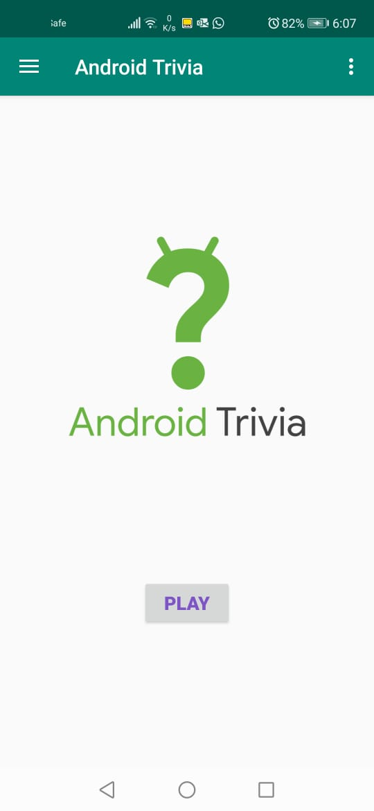
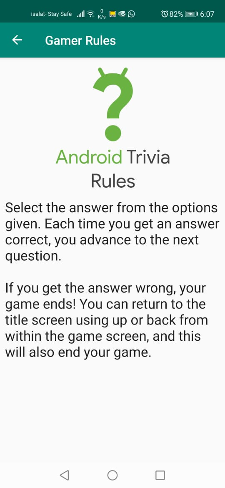
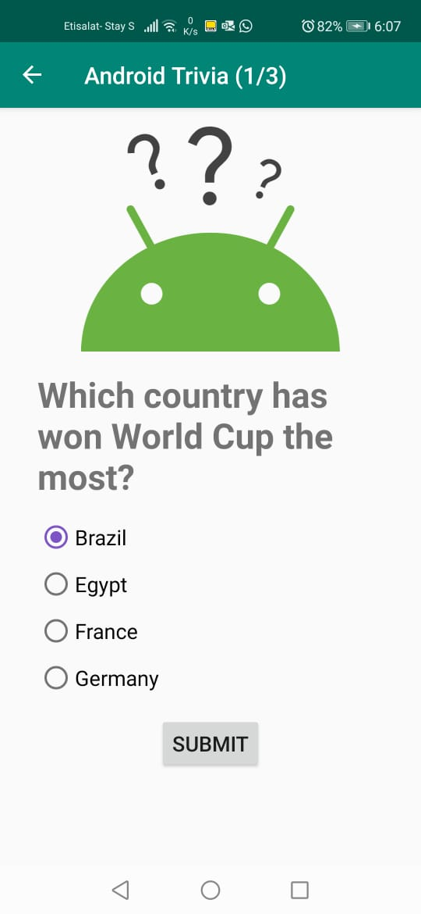
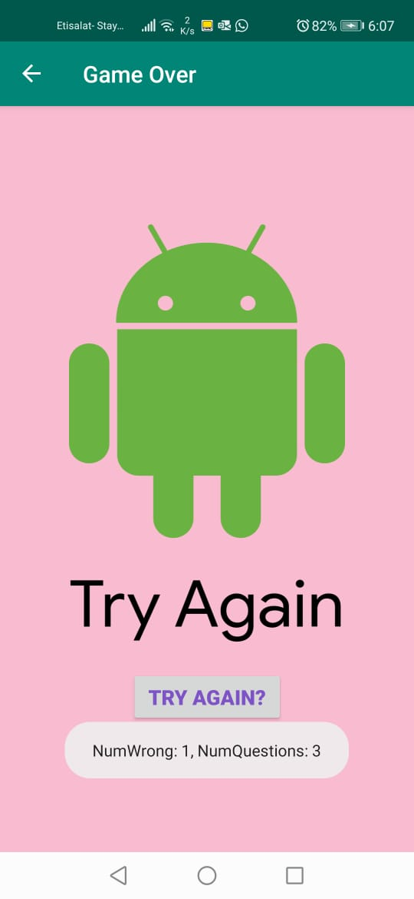

## Questions for Android Trivia 

The Android Trivia application is an application that asks the user trivia questions about General Knowledge,  It makes use of the Navigation component within Jetpack to move the user between different screens.  Each screen is implemented as a Fragment.
The app navigates using buttons, the Action Bar, and the Navigation Drawer.

## Screenshots

 
   
    

## Video Record for the interface of the application.
https://youtu.be/35bEoKaq764
